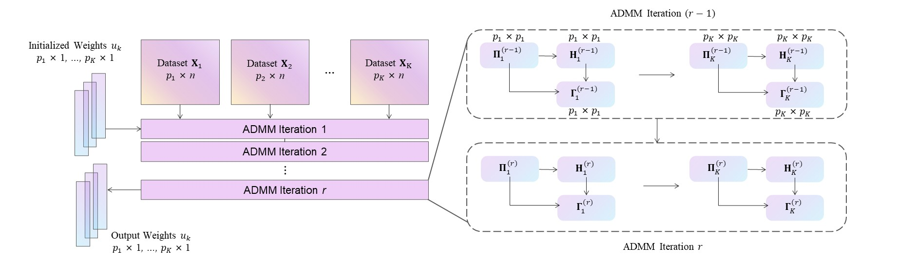
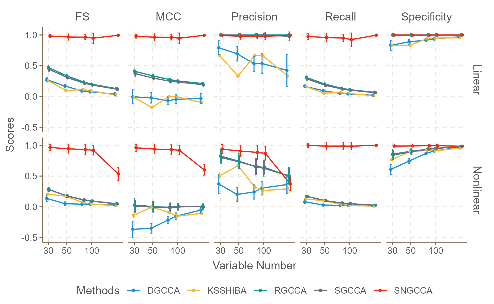
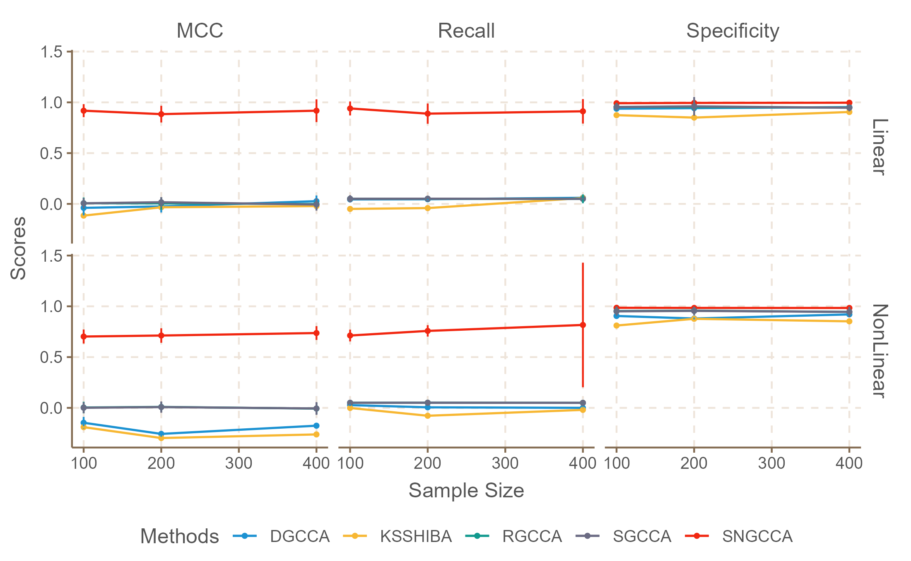
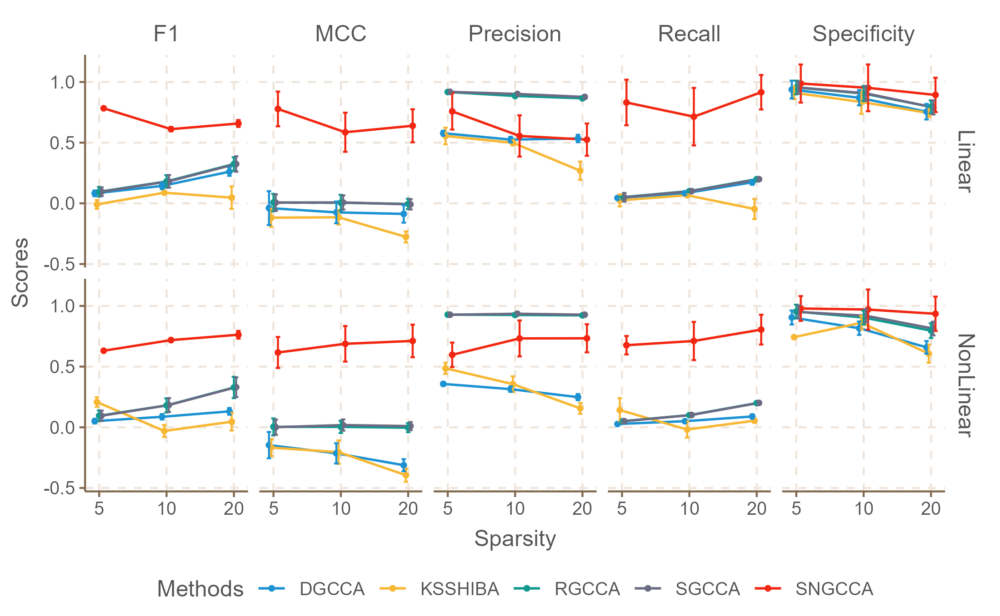
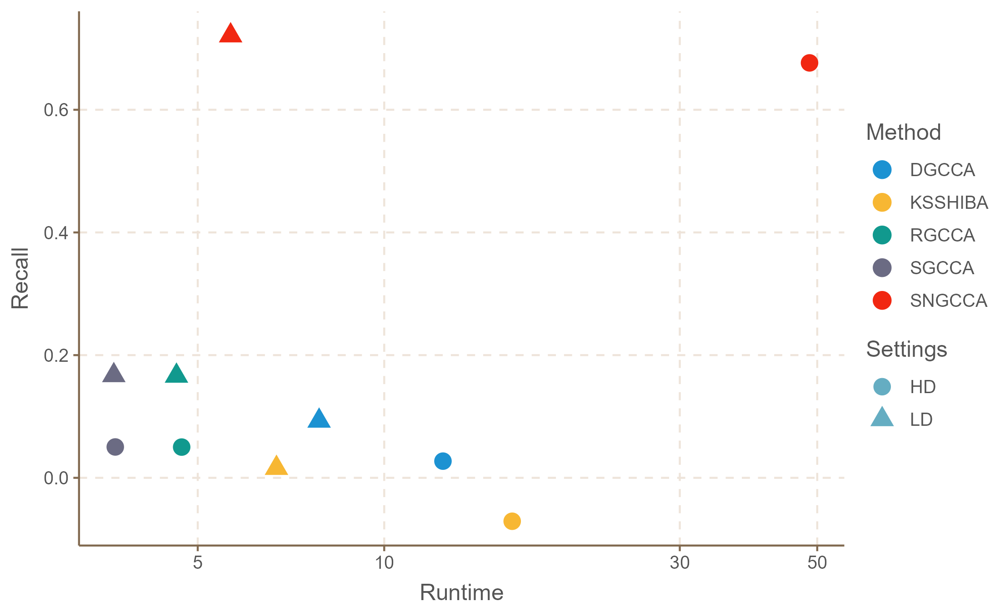

### [Sparse Nonlinear Generalized Canonical Correlation Analysis with Applications in Multiview Genomic Datasets]()

Official Pytorch implementation of SNGCCA, from the following paper:

[Sparse Nonlinear Generalized Canonical Correlation Analysis with Applications in Multiview Genomic Datasets]().  \
Rong Wu, Ziqi Chen and Hai Shu. \
New York University \
[[`arXiv`]()]

---

<p align="center">

</p>

We propose **SNGCCA**.

 ## Installation
Clone this repository and install other required packages:
```
git clone git@github.com:Rows21/SNGCCA
pip install -r requirements.txt
```

 ## Datasets
  - [x] Synthetic Datasets [synth_data.py](/SNGCCA/synth_data.py)
  - [x] TCGA Breast Cancer Database [RealData](/SNGCCA/RealData/) from (https://tcga-data.nci.nih.gov/docs/publications)
 
 (Feel free to post suggestions in issues of recommending latest proposed transformer network for comparison. Currently, the network folder is to put the current SOTA transformer. We can further add the recommended network in it for training.)
 
 <!-- ✅ ⬜️  -->
 ## Results 
 ### Simulation Studies

<div class="main">
<div class="tag">
</div>
<div class="images" >
	<div class="mid">
		
	</div>
	<div class="mid">
		
	</div>
	<div class="mid">
		
	</div>
</div>
<div style="clear:both;"></div>
<div style="margin-bottom:30px;">
</div>


<p>  </p>

### Real-World Studies -- TCGA breast cancer database


## Acknowledgement
This repository is built using the [timm](https://github.com/rwightman/pytorch-image-models) library.

## License
This project is released under the MIT license. Please see the [LICENSE](LICENSE) file for more information.

## Citation
If you find this repository helpful, please consider citing:
```

```